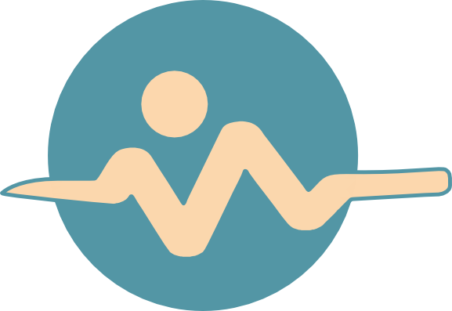
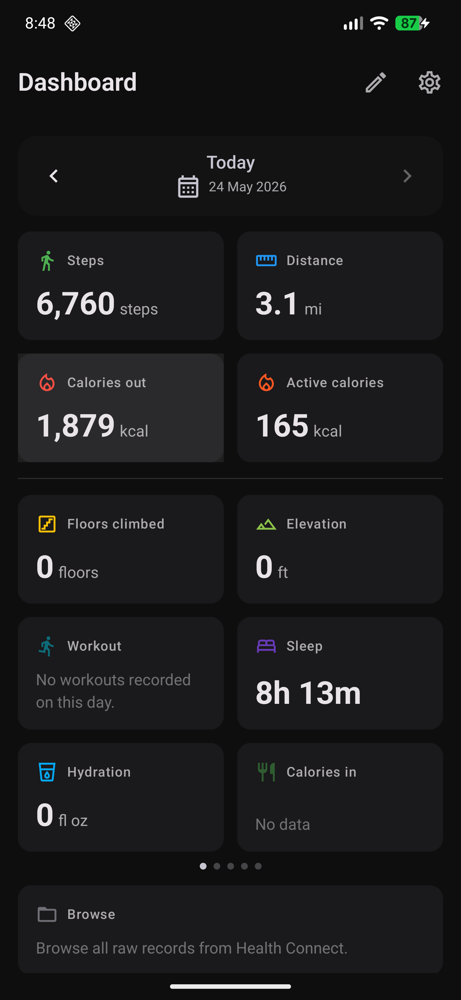
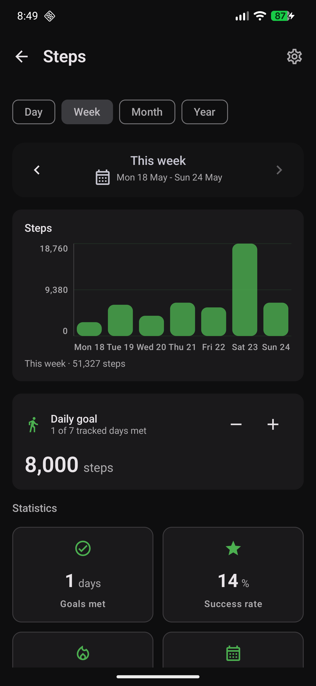
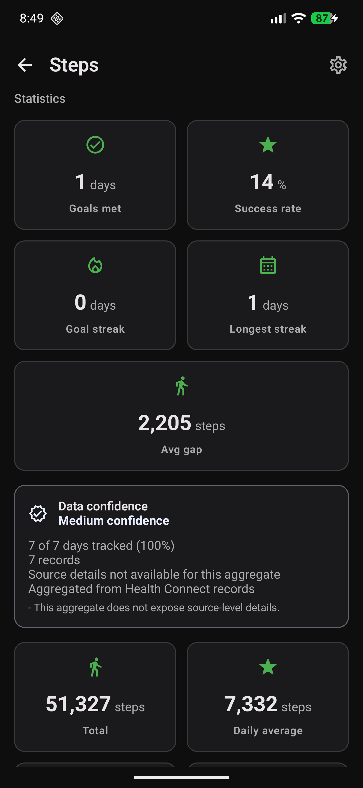
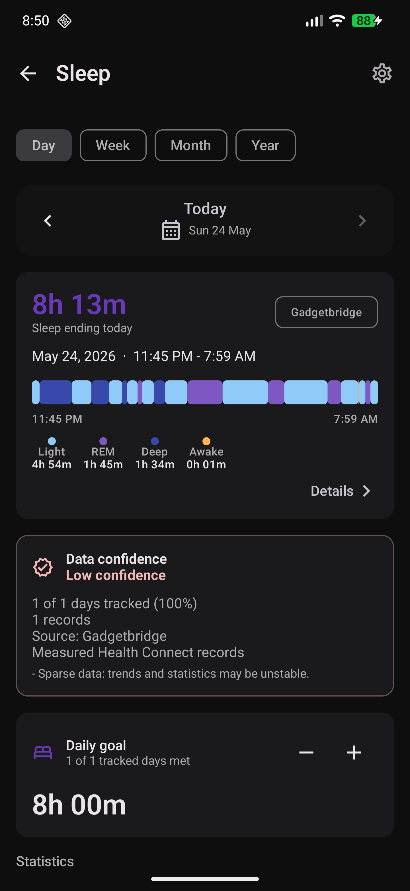

<p align="center">
    
</p>

# OpenVitals

<p align="center">
    <a href="https://liberapay.com/manuel.mmarca.tech/donate"></a>
    <a href="https://liberapay.com/manuel.mmarca.tech/donate"></a>
</p>

Privacy-first Health Connect dashboard, activity tracker, and manual entry app for Android.

OpenVitals helps you review Health Connect data, record or import workouts, import supported Apple Health exports, and add supported manual entries without creating an account or sending health data to an OpenVitals server. The dashboard is read-only by default; writes happen only when you explicitly save or import records back to Health Connect.

## Install

| Channel | Link | Best for |
| --- | --- | --- |
| Google Play | [Install or join testing](https://play.google.com/store/apps/details?id=tech.mmarca.openvitals) |  |
| Codeberg releases | [Download signed release and debug APKs](https://codeberg.org/OpenVitals/android-app/releases) ||
| Source | [Codeberg](https://codeberg.org/OpenVitals/android-app) / [GitHub mirror](https://github.com/mmarca-tech/OpenVitals) | |

## Why OpenVitals

- No account, no ads, no analytics SDKs, no cloud health-data sync
- No app-level `INTERNET` permission in the merged app manifest
- Health Connect remains the source of truth
- Manual entries are written only after an explicit save action
- Sensitive cycle data is requested only as an explicit Health Connect permission category
- Open source under AGPL-3.0-or-later

## Highlights

- Summary dashboard for activity, recovery, beverages, nutrition, body, heart, vitals, mindfulness, and optional cycle data
- Period detail screens with `Day / Week / Month / Year` navigation and reorderable metric sections
- Daily Readiness with Body Energy, Training Readiness, physiological stress, HRV status, intensity minutes, adaptive goals, and local explanation screens
- Refreshed UI/UX with clearer Summary-first navigation, metric screens, and entry flows
- Health Connect permission onboarding with clear data categories and a one-tap full setup option
- Manual logging for beverages with hydration, caffeine, and nutrition defaults, carbohydrate entries, body measurements, vitals, mindfulness, and activities
- Opt-in hydration reminders with active hours, daily-goal pause logic, and automatic hiding after saved hydration entries
- Achievement badges for activity, distance, floors, workouts, hydration, sleep, and mindfulness
- GPX/KML/KMZ/FIT route import, offline PMTiles/Mapsforge map packs, and GPS activity recording with review before saving
- Configurable activity recording dashboard with Focus mode, high-contrast outdoor mode, keep-screen-on support, strength training heart-rate monitoring, and experimental Bluetooth LE sensor integration
- App language support for system default, English, Spanish, German, and Italian
- Apple Health export import for supported activity, heart, body, hydration, and vitals records, with background progress and chunked processing for large exports
- Health Connect 1.2.0-alpha04 coverage for newer activity records and recording permissions
- Wheelchair activity and wheelchair push tracking when Health Connect data is available
- Dedicated Calories detail screen with total, active, and BMR calorie context
- Body composition insights including Fat-Free Mass Index (FFMI) when weight, height, and body fat are available
- Activities and Sleep detail screens with integrated overview cards and direct metric links
- Metric and imperial unit support

## Help Improve It

OpenVitals is still early. Useful feedback is specific: device model, Android version, Health Connect provider version, which permissions were granted, and what screen or workflow failed.

- Try the latest beta from Google Play or Codeberg releases
- Report bugs and feature requests on [Codeberg issues](https://codeberg.org/OpenVitals/android-app/issues)
- Ask questions and discuss support on [OpenVitals Zulip](http://openvitals.zulipchat.com/)
- Star or follow the project on [Codeberg](https://codeberg.org/OpenVitals/android-app) or the [GitHub mirror](https://github.com/mmarca-tech/OpenVitals)
- Share screenshots or notes from real Health Connect setups, especially route recording and manual entry flows
- Support ongoing development on [Liberapay](https://liberapay.com/manuel.mmarca.tech/donate)

## Screenshots

<div>
    
    
    
    
</div>

## Features

- Summary dashboard with grouped sections for activity, recovery, beverages, nutrition, body, heart, vitals, mindfulness, and optional cycle data
- Refreshed Material 3 app shell with Settings and Achievements in the top bar plus dashboard quick actions for logging and starting activities
- Dedicated debug app variant with a separate application ID and diagnostics for troubleshooting
- Period-based detail screens with `Day / Week / Month / Year` navigation and reorderable metric sections
- Feature screens for Activity, Activities, Calories, Sleep, Heart & Vitals, Body, Beverages, Caffeine, Nutrition, Mindfulness, Cycle, Manual entry, Onboarding, and Settings
- Categorized Health Connect onboarding permissions, with one-tap full setup, category-by-category review, and cycle data grouped as an explicit sensitive category
- Write-permission requests available during one-tap setup or from Add entry and metric entry screens, while dashboard views stay read-only
- Daily Readiness, Body Energy, Training Readiness, and Stress Tracking screens with rule-based local explanations and confidence context
- Achievement screen with Fitbit-inspired badges and progress for daily steps, lifetime distance, floors, workouts, hydration, sleep, and mindfulness
- Health Connect availability checks, including unsupported device/profile handling and provider-update messaging
- Feature-gated Mindfulness support when the installed Health Connect provider exposes `FEATURE_MINDFULNESS_SESSION`
- Data Import setting for supported Apple Health `export.xml` or `export.zip` records, with live progress while the import continues in the background
- Cycle tracking with its own dashboard section, period calendar, flow, ovulation, cervical mucus, and basal body temperature views after Health Connect cycle permissions are granted
- Metric/Imperial unit preference in Settings, backed by shared display formatters
- Shared detail-screen scaffold with pull-to-refresh, range selection, period navigation, and calendar date picking
- Explicit manual entry logging for beverages with hydration, caffeine, and nutrition defaults, carbohydrates, activities with optional GPX/KML/KMZ/FIT route import, offline PMTiles/Mapsforge maps, GPS recording, high-contrast outdoor recording, or experimental Bluetooth LE sensors, body measurements, vitals, and mindfulness sessions, written directly to Health Connect

## Current coverage

- Activity: steps, distance, total calories burned, optional total-calorie estimates, active calories, BMR context, floors climbed, elevation gain, wheelchair pushes, workout sessions, and cardio load
- Sleep: sessions, duration, sleep stages, sleep-stage time graphs, sleep score, sleep efficiency, and period overview cards
- Recovery: Daily Readiness, Body Energy, Training Readiness, HRV status, intensity minutes, physiological stress, adaptive goal context, and local explanation screens
- Heart: heart rate samples and summaries, resting heart rate, HRV
- Vitals: blood pressure, SpO2, respiratory rate, body temperature, VO2 max
- Body: weight, BMI, body fat, lean mass, Fat-Free Mass Index (FFMI), bone mass, body water mass, basal metabolic rate
- Manual entry: beverage/hydration entries with drink presets, caffeine, nutrition defaults, and custom amounts; carbohydrate entries; activity sessions with optional GPX/KML/KMZ/FIT route import, offline PMTiles/Mapsforge maps, GPS recording, configurable recording dashboard, Focus mode, high-contrast outdoor mode, strength training heart-rate monitoring, or experimental Bluetooth LE sensors; mindfulness sessions; weight; height; body fat; blood pressure; SpO2; respiratory rate; and body temperature
- Beverages and caffeine: daily and period hydration totals, active caffeine estimates, bedtime guidance, source and time-of-day insights, Health Connect-backed drink logging with preset or custom drinks, tap-to-save container presets, editable per-container serving sizes, and optional reminders
- Achievements: badge progress for activity, distance, floors, workouts, hydration, sleep, and mindfulness milestones
- Nutrition: calories in, meals, macros, caffeine, and selected nutrient totals from Health Connect nutrition records
- Mindfulness: session list and total duration when supported by Health Connect, plus timer-based and manual session logging with bell previews and optional looping background sounds
- Cycle tracking: period days, flow levels, ovulation tests, cervical mucus observations, and basal body temperature when Health Connect cycle permissions are granted
- Entry and session lists are reached from the relevant metric detail screen rather than a global records browser

## Privacy

- No account required
- No cloud sync of health data
- No ads
- No analytics SDKs
- No Google Play Services dependency for app functionality
- Permissions are requested by clear Health Connect categories:
  - Activity & sleep: required for the dashboard
  - Heart & recovery, Body, Activity extras, Nutrition & hydration, Mindfulness, and Vitals: optional
  - Cycle tracking: sensitive optional access, grouped separately so you can grant or skip it explicitly
  - Manual entry write access: available from one-tap onboarding or when you use Add entry or a metric entry screen that needs it
- Permissions can be managed later in Settings
- Health Connect remains the source of truth; OpenVitals does not store health records locally
- Imported Apple Health export records are written to Health Connect and are not uploaded to an OpenVitals service

The merged app manifest does not request the `INTERNET` permission.

## Platform requirements

- Android only
- `minSdk 26`
- `compileSdk 37`
- `targetSdk 36`
- JDK 17 / Java 17 toolchain
- Health Connect required

Health Connect platform notes:

- On Android 14 and newer, Health Connect is part of the system
- On Android 13 and older, the Health Connect app must be installed separately
- Health Connect is not supported in work profiles
- Mindfulness sessions require a Health Connect provider version that supports `FEATURE_MINDFULNESS_SESSION`
- The app uses `androidx.health.connect:connect-client` 1.2.0-alpha04 so AndroidX maps newer activity, mindfulness, and aggregation APIs to the current platform permissions

## Build from source

1. Install a recent Android Studio with Android SDK 37.0 and JDK 17 support.
2. Clone this repository.
3. Open the project in Android Studio, or build from the command line.

In a complete checkout:

```bash
./gradlew :app:assembleDebug
```

To run the same basic checks used by CI:

```bash
./gradlew verifyCi
git diff --check
```

To install on a connected device or emulator:

```bash
./gradlew :app:installDebug
```

On Windows, Gradle or Android Studio can occasionally keep lint cache jars open under `app/build`. If cleaning fails with a locked `lint-cache` jar, stop Gradle daemons first:

```powershell
.\gradlew.bat --stop
Get-CimInstance Win32_Process |
  Where-Object { $_.CommandLine -like '*org.gradle.launcher.daemon.bootstrap.GradleDaemon*' } |
  ForEach-Object { Stop-Process -Id $_.ProcessId -Force }
Remove-Item -LiteralPath app/build -Recurse -Force
```

More local development notes are in [`docs/engineering/development.md`](docs/engineering/development.md).

After launching the app:

1. Complete onboarding
2. Use one-tap setup to grant all requestable Health Connect permissions, or grant Activity & sleep first and then choose individual categories
3. Grant Cycle tracking only if you want period, ovulation, cervical mucus, and basal temperature data shown
4. Use Dashboard for read-only summaries and Add entry for explicit Health Connect logging

## Architecture at a glance

OpenVitals is intentionally simple today:

- one local Android app module
- Jetpack Compose UI with Material 3 app shell and theming
- Navigation Compose
- `ViewModel` + `StateFlow`
- Hilt constructor injection for repositories, services, and ViewModels
- Health Connect AndroidX client wrapped by `HealthConnectManager`
- WorkManager for user-started Apple Health imports that need to continue outside the Settings screen
- feature-specific repositories for activity, sleep, heart, body, hydration, caffeine, nutrition, mindfulness, cycle, and vitals
- local preferences for onboarding completion, acknowledged permissions, unit system, widget order, calorie display mode, caffeine preferences, data import status, timer/background-sound settings, hydration container sizes, and reminders
- shared presentation formatters for units and date/time labels

The current architecture is documented in more detail in [`docs/engineering/architecture.md`](docs/engineering/architecture.md).

## Project layout

- [`app/`](app): Android app module
- [`app/src/main/kotlin/tech/mmarca/openvitals/core/period/`](app/src/main/kotlin/tech/mmarca/openvitals/core/period): app-local period/date-window primitives
- [`app/src/main/kotlin/tech/mmarca/openvitals/features/`](app/src/main/kotlin/tech/mmarca/openvitals/features): feature screens, state, and ViewModels
- [`app/src/main/kotlin/tech/mmarca/openvitals/data/repository/`](app/src/main/kotlin/tech/mmarca/openvitals/data/repository): repositories over Health Connect reads and preferences
- [`app/src/main/kotlin/tech/mmarca/openvitals/core/`](app/src/main/kotlin/tech/mmarca/openvitals/core): app-local period, performance, and presentation primitives
- [`app/src/main/kotlin/tech/mmarca/openvitals/domain/`](app/src/main/kotlin/tech/mmarca/openvitals/domain): app-local models, insight calculations, and preference enums
- [`app/src/main/kotlin/tech/mmarca/openvitals/ui/components/`](app/src/main/kotlin/tech/mmarca/openvitals/ui/components): shared UI scaffolding and navigation components
- [`docs/`](docs): app guide, feature guide, engineering docs, how-to guides, proposals, reference material, and release notes

## Documentation

- [`docs/app/README.md`](docs/app/README.md): user guide, permissions, privacy, FAQ, screenshots, and support
- [`docs/features/README.md`](docs/features/README.md): grouped feature guide
- [`docs/features/feature-map.md`](docs/features/feature-map.md): map from features to routes, widgets, and packages
- [`docs/engineering/development.md`](docs/engineering/development.md): local build, verification, CI, and Windows cleanup notes
- [`docs/engineering/architecture.md`](docs/engineering/architecture.md): current architecture and target direction
- [`docs/engineering/feature-playbook.md`](docs/engineering/feature-playbook.md): checklist for adding a new metric feature
- [`AGENTS.md`](AGENTS.md): implementation guidance for future coding agents


## License

OpenVitals is licensed under the [`GNU Affero General Public License v3.0 or later`](LICENSE).
Project thanks are listed in [`THANKS.md`](THANKS.md), and third-party asset notices are listed in [`THIRD_PARTY_NOTICES.md`](THIRD_PARTY_NOTICES.md).
