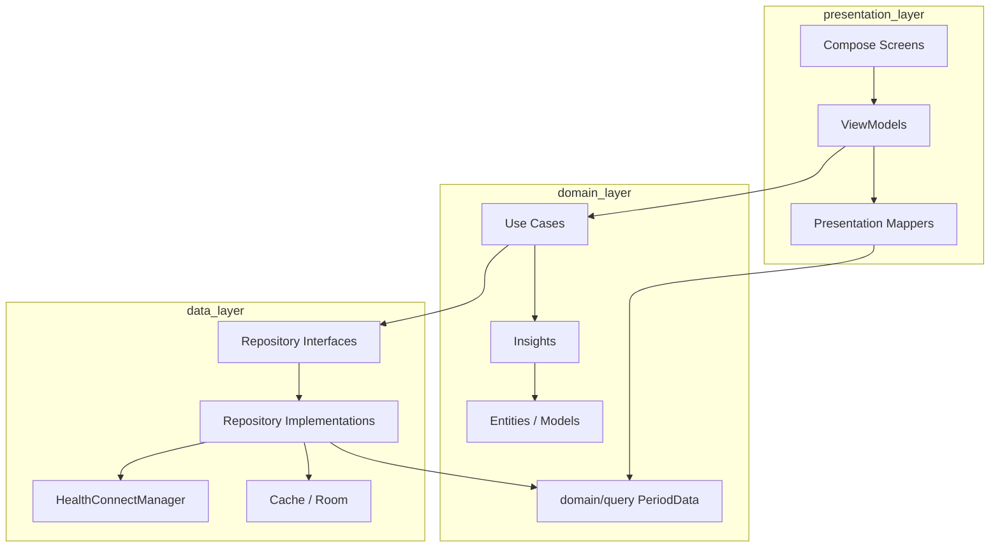

# Clean Architecture Refactor Guide

## Current state

OpenVitals implements a **pragmatic three-layer model** inside one Android module. It is **not** full Clean Architecture with a use case per screen, but the **P0–P3 gap-closure program** (June 2026) added use cases, repository interfaces, domain query DTOs, and presentation mappers where complexity justified them.

## Layer mapping

| Clean Architecture concept | OpenVitals location | Maturity |
|--------------------------|---------------------|----------|
| **Entities** | `domain/model` | Strong — mostly pure Kotlin |
| **Use cases** | `domain/usecase/` for dashboard, heart, sleep loads; calculations in `domain/insights` | Good for heavy flows; implicit elsewhere |
| **Interface adapters** | `features/*` (UI + mappers), `data/repository` (data access) | Strong |
| **Frameworks & drivers** | `healthconnect`, Room, Compose, WorkManager | Correct placement |

### Dependency direction (intended)

```
features (UI + ViewModel + PresentationMapper)
    → domain/usecase, domain/query, domain/model, data/repository/contract, core
domain/usecase
    → data/repository/contract, domain/query, domain/insights
data/repository (*Impl)
    → healthconnect, domain, Android SDK, Health Connect
domain
    → Kotlin stdlib (minimal Android in preferences)
```

`healthconnect` depends on `domain` models, not on `data.repository`. Repositories depend on `healthconnect` and `domain`.

## What already aligns with Clean Architecture

1. **Pure domain models** — `SleepData`, `ExerciseData`, etc. without Health Connect types
2. **Period query DTOs** in `domain/query/` — `SleepPeriodData`, `HeartPeriodData`, etc.
3. **Insight calculations** in `domain/insights` — testable without Android
4. **Period primitives** in `core/period` — no UI or repository coupling
5. **Feature repositories as interfaces** — `data/repository/contract/` + `*Impl` in Hilt
6. **Health Connect isolation** in `healthconnect/` package
7. **Narrow `HealthRepository`** — permissions + availability only (~55 lines in `HealthRepositoryImpl`)
8. **Dashboard aggregation** in `domain/dashboard/DashboardAggregator` + `DashboardDataLoader`
9. **Presentation mappers** — ViewModels map use case / repository results → `@Immutable` `UiState`

## Remaining gaps vs. strict Clean Architecture

| Gap | Description |
|-----|-------------|
| Partial use case layer | Only dashboard, heart, and sleep loads have explicit use cases |
| Some repositories concrete-only | Nutrition, mindfulness, cycle, vitals still bind impl classes directly |
| Large non-metric screens | Manual-entry and settings screens can still exceed ~400 lines |
| Multi-module split | Still single `:app` module (intentionally deferred) |

## What not to do

Per [architecture.md](../architecture.md) and [AGENTS.md](../../AGENTS.md):

- Premature **multi-module** split (`:domain`, `:data`, `:feature`) without a second app consumer
- **Universal chart framework** that hides metric semantics
- **Giant `BasePeriodViewModel`** hierarchy
- **MVI / reducer** for straightforward period-detail screens
- **Raw Health Connect mirror** in Room
- **General background-sync layer** beyond existing cache and import workers

## Phased migration plan — status

### Phase 1 — Strengthen domain ✅ Complete

- [x] Move `*PeriodData` result types → `domain/query/`
- [x] Extract dashboard aggregation → `DashboardAggregator` + `DashboardDataLoader`
- [x] Slim `HealthRepository` to permissions/availability

### Phase 2 — Use cases for complex flows ✅ Complete (scoped)

| Use case | Replaces logic in | Status |
|----------|-------------------|--------|
| `LoadSleepPeriodUseCase` | `SleepViewModel.load` | Done |
| `LoadDashboardDayUseCase` | `DashboardViewModel.load` | Done |
| `LoadHeartPeriodUseCase` | `HeartViewModel.load` | Done |

Do **not** create a use case per trivial repository call. Add new use cases only when orchestration is non-trivial.

Example shape (implemented):

```kotlin
class LoadSleepPeriodUseCase @Inject constructor(
    private val sleepRepository: SleepRepository,
    private val heartRepository: HeartRepository,
    private val dispatchers: DispatcherProvider,
) {
    suspend operator fun invoke(/* query, modes */): SleepPeriodResult = coroutineScope {
        // parallel fetch + combine
    }
}
```

### Phase 3 — Repository interfaces ✅ Complete (top 6)

Interfaces + `@Binds` in `RepositoryModule`:

- `SleepRepository`, `ActivityRepository`, `HealthRepository`
- `HeartRepository`, `HydrationRepository`, `BodyRepository`

Implementations renamed to `*Impl`. Remaining feature repos can follow the same pattern when touched.

### Phase 4 — Presentation mapping layer ✅ Complete (metric screens)

Each migrated metric feature has:

- `*PresentationMapper` (+ unit tests)
- `*DisplayState` or display payload on `UiState`
- ViewModel builds display on `DispatcherProvider.default`
- Thin route composable (< ~150 lines)

See per-feature table in [refactor-backlog.md](refactor-backlog.md).

## Target architecture diagram



Solid lines represent **current** wiring. Use cases and repo interfaces are in place for the heaviest boundaries; lighter features still use VM → Repo directly.

## Module split criteria (future)

Stay single-module until:

- A second app or SDK must consume `domain` + contracts
- Build times or team ownership force physical boundaries
- You need to publish a library artifact

Until then, **package boundaries** (`domain`, `data`, `features`, `healthconnect`) are sufficient.

## Success criteria

Clean Architecture migration is successful when:

- New metrics add a use case only if orchestration is non-trivial ✅ policy in place
- Repositories stay thin mappers + permission guards ✅ metric repos follow this
- ViewModels are mostly state machines + `UiState` mapping ✅ metric ViewModels migrated
- Domain tests cover business rules without MockK ✅ insights, aggregators, use cases tested
- Compose screens contain no repository or Health Connect imports ✅ metric routes comply
- Docs remain proportional — no ceremony for simple CRUD-style screens ✅

## Related documents

- [mvvm-repository.md](mvvm-repository.md) — current repository rules
- [refactor-backlog.md](refactor-backlog.md) — ordered work items and tracker
- [architecture.md](../architecture.md) — source of truth for new work
