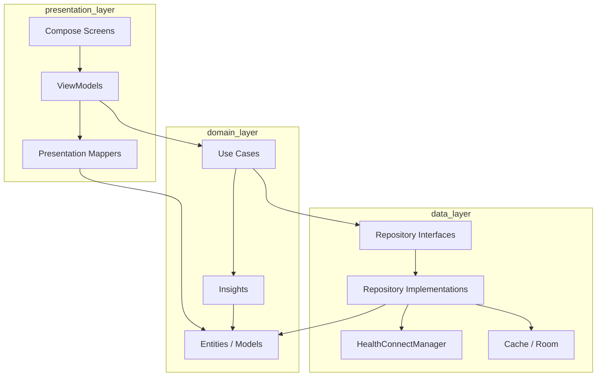

# Clean Architecture Refactor Guide

## Current state

OpenVitals implements a **pragmatic three-layer model** inside one Android module. It is **not** full Clean Architecture with explicit use cases, repository interfaces, and framework isolation — and the project docs intentionally avoid over-correcting into that model prematurely.

## Layer mapping

| Clean Architecture concept | OpenVitals location | Maturity |
|--------------------------|---------------------|----------|
| **Entities** | `domain/model` | Strong — mostly pure Kotlin |
| **Use cases** | Implicit in ViewModels; calculations in `domain/insights` | Partial |
| **Interface adapters** | `features/*` (UI), `data/repository` (data access) | Good |
| **Frameworks & drivers** | `healthconnect`, Room, Compose, WorkManager | Correct placement |

### Dependency direction (intended)

```
features (UI + ViewModel)
    → data/repository, domain, core
data/repository, healthconnect
    → domain, Android SDK, Health Connect
domain
    → Kotlin stdlib (minimal Android in preferences)
```

`healthconnect` depends on `domain` models, not on `data.repository`. Repositories depend on `healthconnect` and `domain`.

## What already aligns with Clean Architecture

1. **Pure domain models** — `SleepData`, `ExerciseData`, etc. without Health Connect types
2. **Insight calculations** in `domain/insights` — testable without Android
3. **Period primitives** in `core/period` — no UI or repository coupling
4. **Feature repositories** as facades — single entry for feature-shaped queries
5. **Health Connect isolation** in `healthconnect/` package
6. **Narrowing `HealthRepository`** — dashboard/permissions vs. feature reads

## Gaps vs. strict Clean Architecture

| Gap | Description |
|-----|-------------|
| No use case layer | ViewModels call repositories directly |
| No repository interfaces | Concrete classes bound in Hilt |
| DTOs in data layer | `SleepPeriodData`, `HeartPeriodData` live in `data.repository` |
| Large ViewModels | `HeartViewModel`, `DashboardViewModel` combine orchestration + mapping |
| UI derivation | Some domain logic still runs in Compose (`SleepScreen`) |
| `HealthRepository` size | Dashboard aggregation blurs repository vs. domain service |

## What not to do

Per [architecture.md](../architecture.md) and [AGENTS.md](../../AGENTS.md):

- Premature **multi-module** split (`:domain`, `:data`, `:feature`) without a second app consumer
- **Universal chart framework** that hides metric semantics
- **Giant `BasePeriodViewModel`** hierarchy
- **MVI / reducer** for straightforward period-detail screens
- **Raw Health Connect mirror** in Room
- **General background-sync layer** beyond existing cache and import workers

## Phased migration plan

### Phase 1 — Strengthen domain (low risk)

**Goal:** Pure Kotlin owns business results; data layer only fetches and maps.

1. Move `*PeriodData` result types from `data.repository` → `domain/model` or new `domain/query/`
2. Extract dashboard aggregation from `HealthRepository` into:
   - `domain/dashboard/DashboardAggregator.kt` (pure combine logic), or
   - `domain/insights` helpers already used by dashboard
3. Keep repository methods as thin: fetch → map → return domain types

**Acceptance:** `domain` has no new imports from `data` or `healthconnect`.

### Phase 2 — Use cases for complex flows (medium risk)

**Goal:** Thin ViewModels; test orchestration without UI state.

Introduce use cases only where complexity justifies them:

| Use case | Replaces logic in |
|----------|-------------------|
| `LoadSleepPeriodUseCase` | `SleepViewModel.load` |
| `LoadDashboardDayUseCase` | `DashboardViewModel.load` |
| `LoadHeartPeriodUseCase` | `HeartViewModel.load` |

Shape:

```kotlin
class LoadSleepPeriodUseCase @Inject constructor(
    private val sleepRepository: SleepRepository,
    private val heartRepository: HeartRepository,
    private val dispatchers: DispatcherProvider,
) {
    suspend operator fun invoke(
        query: PeriodLoadQuery,
        sleepRangeMode: SleepRangeMode,
        refreshMode: RefreshMode = RefreshMode.NORMAL,
    ): SleepPeriodResult = coroutineScope {
        val periodData = sleepRepository.loadSleepPeriod(query, sleepRangeMode, refreshMode)
        val hrv = async {
            heartRepository.loadDailyHrv(query.windows.current)
        }
        SleepPeriodResult(periodData, hrv.await())
    }
}
```

ViewModel:

```kotlin
runCatching { loadSleepPeriodUseCase(query, sleepRangeMode, refreshMode) }
    .onSuccess { /* map to UiState */ }
```

Do **not** create a use case per trivial repository call.

### Phase 3 — Repository interfaces (medium risk)

**Goal:** Explicit boundaries for testing and future modules.

```kotlin
interface SleepRepository {
    suspend fun loadSleepPeriod(
        query: PeriodLoadQuery,
        sleepRangeMode: SleepRangeMode,
        refreshMode: RefreshMode = RefreshMode.NORMAL,
    ): SleepPeriodData
}
```

Hilt:

```kotlin
@Binds
@Singleton
abstract fun bindSleepRepository(impl: SleepRepositoryImpl): SleepRepository
```

Start with: `SleepRepository`, `HealthRepository`, `ActivityRepository`.

Rename implementations to `*Impl` only when introducing interfaces to avoid churn.

### Phase 4 — Presentation mapping layer (low–medium risk)

**Goal:** ViewModels only map use case results → `UiState`; expensive display prep off main thread.

```kotlin
// features/sleep/SleepPresentationMapper.kt
object SleepPresentationMapper {
    fun toUiState(
        raw: SleepPeriodResult,
        selection: PeriodSelection,
        sleepRangeMode: SleepRangeMode,
    ): SleepDisplayPayload = /* duration points, summaries, scores */
}
```

Or private functions on ViewModel using `withContext(dispatchers.default)`.

Aligns with [compose-performance.md](compose-performance.md) and [viewmodel-stateflow.md](viewmodel-stateflow.md).

## Target architecture diagram



Solid lines represent **today** (VM → Repo). Dashed migration adds UC and RepoI without removing feature packages.

## Module split criteria (future)

Stay single-module until:

- A second app or SDK must consume `domain` + contracts
- Build times or team ownership force physical boundaries
- You need to publish a library artifact

Until then, **package boundaries** (`domain`, `data`, `features`, `healthconnect`) are sufficient.

## Success criteria

Clean Architecture migration is successful when:

- New metrics add a use case only if orchestration is non-trivial
- Repositories stay thin mappers + permission guards
- ViewModels are mostly state machines + `UiState` mapping
- Domain tests cover business rules without MockK
- Compose screens contain no repository or Health Connect imports
- Docs remain proportional — no ceremony for simple CRUD-style screens

## Related documents

- [mvvm-repository.md](mvvm-repository.md) — current repository rules
- [refactor-backlog.md](refactor-backlog.md) — ordered work items
- [architecture.md](../architecture.md) — source of truth for new work
