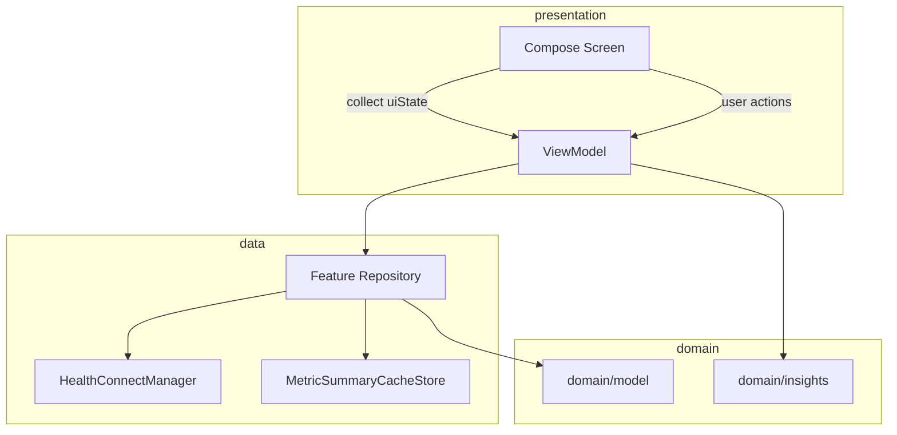

# MVVM and Repository Pattern

## Overview

OpenVitals follows **MVVM with a feature-oriented Repository pattern** inside a single `:app` module. ViewModels orchestrate loads and expose UI-ready state; repositories answer feature-shaped queries; Health Connect specifics stay below the repository layer.

## Canonical ViewModel pattern

Each screen feature typically defines:

1. `data class XxxUiState(...)` — immutable screen state
2. `MutableStateFlow` / `StateFlow` — single source of truth
3. User actions as functions (`selectRange`, `load`, `previousPeriod`, …)
4. Repository calls inside `load()` wrapped in `runCatching`
5. `LoadCoordinator` to ignore results from superseded requests

Example (`SleepViewModel.load`):

```kotlin
fun load(refreshMode: RefreshMode = RefreshMode.NORMAL) {
    loadCoordinator.launch(viewModelScope) load@{
        val query = PeriodLoadQuery(
            range = periodDriver.selection.selectedRange,
            anchorDate = periodDriver.selection.selectedDate,
            weekPeriodMode = _uiState.value.weekPeriodMode,
        )
        _uiState.value = _uiState.value.copy(isLoading = true, error = null)
        runCatching {
            repository.loadSleepPeriod(query, sleepRangeMode, refreshMode)
            // ...
        }
            .onSuccess { result ->
                if (!isCurrent) return@load
                _uiState.value = _uiState.value.copy(isLoading = false, /* payload */)
            }
            .onFailure {
                if (!isCurrent) return@load
                _uiState.value = _uiState.value.copy(isLoading = false, error = it.message)
            }
    }
}
```

## Repository boundaries

### Feature repositories (preferred for detail data)

| Repository | Responsibility |
|------------|----------------|
| `ActivityRepository` | Steps, distance, calories, workouts |
| `SleepRepository` | Sleep sessions, period bundles |
| `HeartRepository` | Heart rate, HRV, resting HR |
| `BodyRepository` | Weight, body composition |
| `HydrationRepository` | Hydration records |
| `NutritionRepository` | Nutrition aggregates |
| `MindfulnessRepository` | Mindfulness sessions |
| `CycleRepository` | Menstruation / cycle data |
| `VitalsRepository` | BP, SpO2, respiratory rate, etc. |

Each repository should:

- Guard required Health Connect permissions
- Call `HealthConnectManager` (not the AndroidX client directly from features)
- Return app models from `domain/model` or feature-specific period result types
- Prefer period-oriented APIs: `loadXPeriod(PeriodLoadQuery, …)`

Example (`SleepRepository`):

- Uses `PeriodLoadQuery` windows (current, previous, baseline)
- Optionally caches via `MetricSummaryCacheStore` + permission fingerprint
- Maps Health Connect records to `SleepData` before returning

### `HealthRepository` (app-level only)

Documented scope:

- Health Connect availability
- Permission contract and granted/missing sets
- Dashboard aggregation

**Do not** add new feature-detail read methods here unless during a temporary migration.

**Current gap:** `HealthRepository` is still very large (~1,600 lines) because dashboard aggregation and some insight calculation live inside it. Consider extracting a `DashboardAggregator` or similar domain service over time.

### `PreferencesRepository`

Persists UI preferences: theme, units, per-screen `TimeRange`, daily goals, widget order. ViewModels inject it for initial range and `onRangeSelected` callbacks.

## Period navigation

`PeriodSelectionDriver` (`core/period`) is shared across detail ViewModels:

- `selectRange`, `previousPeriod`, `nextPeriod`, `selectDate`
- Caps forward navigation at the current period
- Tracks whether the user pinned a past period (`resumeCurrentPeriod`)

ViewModels hold a driver instance and mirror `selectedRange` / `selectedDate` into `UiState` via `applyPeriodSelection`.

## Data flow diagram



## Gaps and recommendations

### No repository interfaces

ViewModels depend on concrete `@Singleton` classes. Unit tests use MockK successfully, but:

- No compile-time boundary between domain and data
- Harder to swap fakes in instrumented tests or future modules

**Recommendation:** Add interfaces for high-traffic repositories (`SleepRepository`, `HealthRepository`, `ActivityRepository`) when touching those files; bind implementations in Hilt.

### Result DTOs in `data.repository`

Types like `SleepPeriodData`, `HeartPeriodData` live next to repository implementations. In stricter Clean Architecture these belong in `domain` as query results.

**Recommendation:** Move period result types to `domain/model` or `domain/query` incrementally.

### Multi-repository ViewModels

Some ViewModels coordinate multiple repositories:

- `SleepViewModel` + `HeartRepository` (cross-metric HRV)
- `HeartViewModel` + `VitalsRepository`
- `DashboardViewModel` + `HealthRepository` + `ActivityRepository`

This is valid MVVM orchestration. When a ViewModel exceeds ~300 lines of load logic, extract a **use case** (see [clean-architecture-refactor.md](clean-architecture-refactor.md)).

## Rules for new work

1. Add feature reads to the **feature repository**, not `HealthRepository`
2. Use `PeriodLoadQuery` and bundled period APIs (current + previous + baseline)
3. Keep write paths in feature repositories used by manual-entry ViewModels
4. Use `RefreshMode.FORCE` for pull-to-refresh; `NORMAL` for navigation loads
5. Follow [feature-playbook.md](../feature-playbook.md) for Hilt and test constructors
