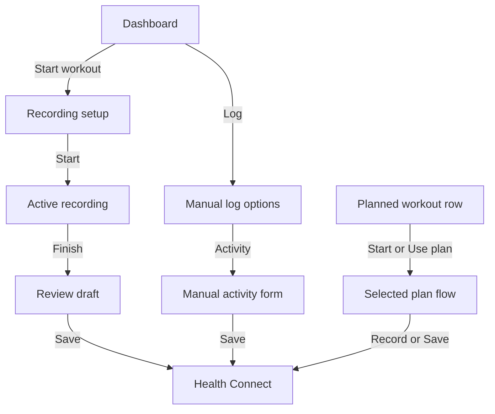

# Activity Start Flow Simplification Proposals

This document explains the proposed improvements for making activity recording, manual activity logging, and planned-workout starts faster and easier to understand.

The core product goal is:

> When the user taps a button, the next screen should match the intent of that button.

Today, many activity-related actions open the same generic Activity Entry source chooser. That keeps the code centralized, but it adds extra screens and makes the user decide again what they already meant to do.

## 1. Intent-Specific Activity Entry Routes

### Current Problem

Most activity actions navigate to the same route:

```text
manual_entry/activity
```

That screen starts in source-selection mode, so the user must choose what kind of activity action they want:

- Create manual activity.
- Create from existing plan.
- Record GPS activity.
- Import route file.

This is inefficient when the previous button already told us the user's intent.

Example:

```text
Dashboard Start -> Activity Entry -> Choose "Record GPS activity"
```

The user tapped `Start`, but the app still asks what they want to do.

### Proposed Behavior

Support direct entry intents, for example:

```text
manual_entry/activity?mode=record
manual_entry/activity?mode=manual
manual_entry/activity?mode=plan
manual_entry/activity?planId=abc123
manual_entry/activity?activityTypeId=running
```

Then each button can open the right state immediately.

### User Impact

| User Action | Current Flow | Proposed Flow |
|---|---|---|
| Start workout | Open source chooser, then choose record | Open recording setup directly |
| Add manual activity | Open source chooser, then choose manual | Open manual form directly |
| Use a plan | Open source chooser, choose plan source, choose type, choose plan | Open selected plan directly |
| Import route | Open source chooser, then choose import | Open import/review directly |

### Why This Helps

This does not require splitting the whole feature into many new screens. The existing Activity Entry feature can remain the central implementation. The route simply carries the user's intent into the screen.

## 2. Merge GPS Setup And First Start

### Current Problem

The GPS recording path has two start-like actions:

```text
Dashboard Start
-> Record GPS activity
-> Go to activity screen
-> Start
```

The confusing part is `Go to activity screen`. It feels like a start action, but it only opens an idle recording dashboard. The user must then tap `Start` again.

### Proposed Behavior

When GPS permissions and location fix are ready, the setup screen's primary button should start the recording immediately.

Proposed flow:

```text
Start workout
-> Recording setup
-> Start
-> Active recording dashboard
```

### User Impact

| Flow | Current Minimum Taps | Proposed Minimum Taps |
|---|---:|---:|
| GPS recording from dashboard | 4 | 2 or 3 |
| GPS recording after direct route support | 3 | 2 |

### Important Detail

The idle dashboard can still exist internally for edge cases, cancellation, dashboard editing, or GPS preview. The key change is that it should not be a required extra stop in the common start flow.

## 3. Make Planned Workout Rows Actionable

### Current Problem

Planned workouts are visible in the Activities overview, but they are display-only.

Current user experience:

```text
User sees planned workout
-> Cannot start it there
-> Opens Activity Entry
-> Chooses "Create from existing plan"
-> Chooses activity type
-> Chooses the same plan again
```

The app shows the right object but does not let the user act on it.

### Proposed Behavior

Turn each planned workout row into an action surface.

Possible actions:

| Planned Workout State | Suggested Action |
|---|---|
| Not completed, live-recordable activity | `Start` |
| Not completed, better as manual entry | `Use plan` or `Log` |
| Completed | Completed/read-only state |
| Missing permissions | Permission action or disabled state with explanation |

### Proposed Flow

```text
Activities overview
-> Tap planned workout row or Start button
-> Activity Entry opens with that plan already selected
-> User starts recording or reviews prefilled activity
```

### User Impact

| Flow | Current Minimum Taps | Proposed Minimum Taps |
|---|---:|---:|
| Use visible planned workout | No direct path | 1 to open/start |
| Use plan from dashboard/activity flow | 5 | 2 |

### Why This Helps

Planned workouts already have strong context: activity type, title, time, duration, and completion state. The row is the best place to start from because the user has already found the exact workout.

## 4. Auto-Skip Single-Choice Plan Picker Steps

### Current Problem

The planned workout flow always asks the user to choose:

```text
Plan source
-> Activity type
-> Specific plan
```

That is useful when there are many plans, but wasteful when there is only one obvious option.

### Proposed Behavior

After planned workouts are loaded:

- If there is only one planned activity type, skip the activity-type picker.
- If there is only one plan for that activity type, apply it immediately.
- If one plan is scheduled near the current time, place it first or preselect it.
- If there are multiple reasonable choices, keep the picker.

### Example

Current:

```text
Create from existing plan
-> Choose Strength Training
-> Choose "Upper Body A"
-> Manual form
```

Proposed when there is only one plan:

```text
Create from existing plan
-> Manual form prefilled with "Upper Body A"
```

### User Impact

| Scenario | Current | Proposed |
|---|---|---|
| One activity type, one plan | User still chooses both | Apply plan immediately |
| One activity type, many plans | User chooses type, then plan | Skip type, choose plan |
| Many activity types | User chooses type, then plan | Same as today |

### Why This Helps

This is a low-risk improvement because it preserves the current screens when choices are genuinely needed. It only removes screens where the user has no meaningful decision to make.

## 5. Split Dashboard Actions By Clearer Intent

### Current Problem

The dashboard has quick actions:

- `Log`
- `Start`

But `Start` opens the generic Activity Entry source chooser. From there, the user can choose manual entry, planned workout, recording, or route import.

That creates a mismatch:

```text
Button says: Start
Screen asks: What source do you want?
```

### Proposed Behavior

Make dashboard actions map to clear user intents.

Suggested dashboard model:

| Dashboard Action | Destination |
|---|---|
| `Start workout` | Recording setup directly |
| `Log` | Manual logging options or manual-entry hub |
| Planned workout row/card | Selected planned workout |
| Overflow or secondary action | Import route, use plan, advanced options |

### Proposed Flow

```text
Dashboard
-> Start workout
-> Recording setup
-> Start
```

For manual logging:

```text
Dashboard
-> Log
-> Choose metric or activity manual form
```

For plans:

```text
Dashboard or Activities overview
-> Planned workout
-> Start or use selected plan
```

### Why This Helps

Users should not need to understand the app's internal source model. They should see actions that match how they think:

- "I want to start exercising now."
- "I want to log something I already did."
- "I want to do this planned workout."
- "I want to import a file."

## Recommended Implementation Order

### Step 1: Add Intent-Specific Routes

This creates the foundation. Without direct routes, every improvement still has to pass through the generic source chooser.

Expected result:

```text
Dashboard Start -> Recording setup
Activities Add -> Manual activity form
Plan row -> Selected plan
```

### Step 2: Wire Dashboard Start To Recording Setup

Change the dashboard `Start` action so it opens the recording setup directly with the preferred live-recordable activity.

Expected result:

```text
Start -> Recording setup
```

### Step 3: Merge GPS Setup And Start

Make the setup primary button start GPS recording immediately once permissions and location fix are ready.

Expected result:

```text
Start -> Recording setup -> Active recording
```

### Step 4: Make Planned Workout Rows Actionable

Add actions to planned workout rows and route selected plans into Activity Entry.

Expected result:

```text
Tap planned workout -> Selected plan opens directly
```

### Step 5: Auto-Skip Plan Picker Steps

Skip unnecessary plan picker screens when there is only one valid option.

Expected result:

```text
Use plan -> Prefilled form when only one plan exists
```

### Step 6: Refine Dashboard Copy And Layout

Once the direct flows exist, rename and arrange the quick actions so they match behavior:

- `Start workout`
- `Log`
- Planned workout action
- Optional overflow for imports/advanced actions

## Target Future Flow

The ideal common flows should look like this:



The main win is not just fewer taps. It is that each path becomes easier to predict.
