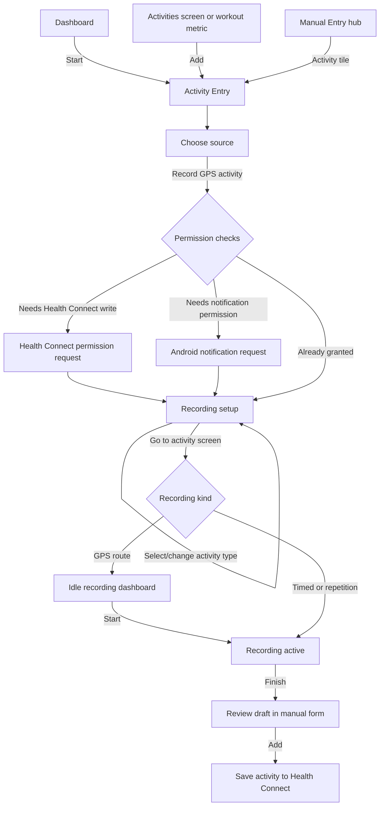
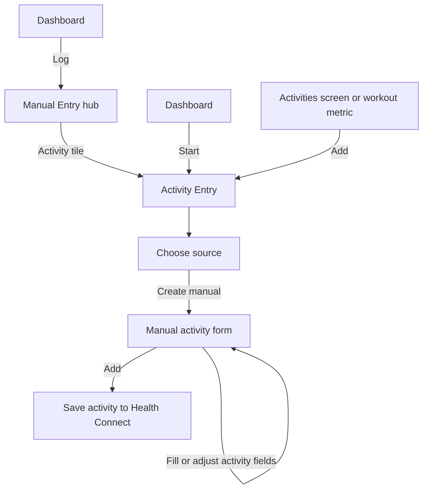
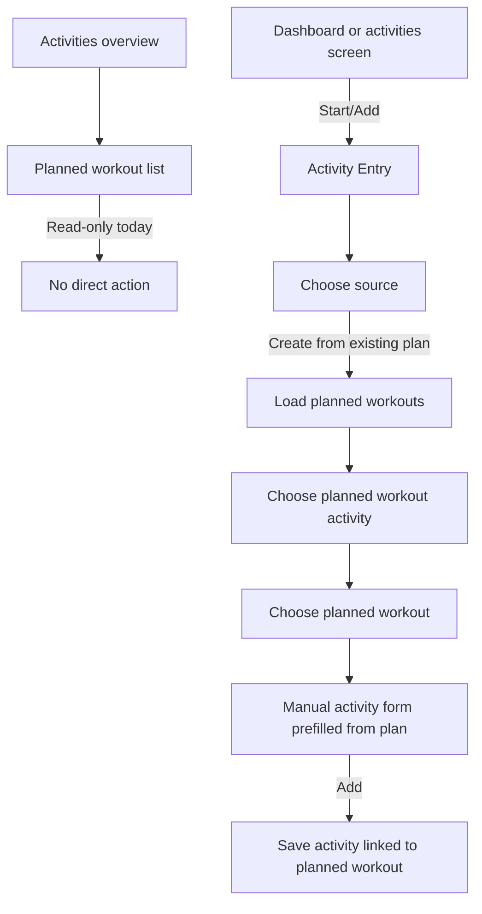

# Activity Start Flow Analysis

> **Status:** Analysis and proposal context. Current implemented behavior remains documented in [Recording of activity](../features/activity-recording.md).
> **Implementation map:** [Feature map](../features/feature-map.md).

This document maps the current paths for starting or creating an activity, then proposes ways to reduce taps and make the intent clearer.

For a clearer breakdown of each proposed improvement, see [Activity start flow simplification proposals](activity-start-flow-proposals.md).

## Current Entry Points

Activity creation is routed through `Screen.ActivityEntry` (`manual_entry/activity`). That destination starts in `ActivityEntryMode.CHOOSE_SOURCE`, so most paths first land on a source chooser before they can record, create a manual entry, import a route, or use a planned workout.

Relevant code touchpoints:

- `navigation/AppNavigation.kt`: dashboard quick actions, activity add action, and navigation into `Screen.ActivityEntry`.
- `navigation/AppNavigationManualEntryRoutes.kt`: activity entry route wiring.
- `features/dashboard/DashboardQuickActions.kt`: dashboard `Log` and `Start` buttons.
- `features/manualentry/activity/ActivityEntryScreen.kt`: permission gates and source actions.
- `features/manualentry/activity/ActivityEntryFormContent.kt`: mode-to-screen switch.
- `features/manualentry/activity/recording/ActivityRecordingSetupScreen.kt`: pre-recording setup.
- `features/manualentry/activity/recording/ActivityRecordingScreen.kt`: live/idle recording dashboard.
- `features/activity/ActivitiesOverviewSections.kt`: planned workout list, currently display-only.

## Recording Flow

The dashboard has a primary `Start` action, but that action still opens the generic activity entry source chooser. From there, the user picks recording, confirms setup, and for GPS activities taps start again inside the recording dashboard.

Minimum taps after the dashboard is visible:

- GPS recording: `Start` -> `Record GPS activity` -> `Go to activity screen` -> `Start` = 4 taps, before finish/review/save.
- Timed or repetition recording: `Start` -> `Record GPS activity` -> `Go to activity screen` = 3 taps, because setup starts those recordings immediately.
- From `Log`/manual entry hub: add one extra tap for the Activity tile.
- Extra taps appear for permission prompts, choosing a non-default activity type, changing recording settings, finishing, reviewing, and saving.

Main friction:

- `Start` does not start directly; it opens the source chooser.
- GPS recording has two start-like decisions: setup's `Go to activity screen`, then the dashboard's `Start`.
- The source chooser treats manual entry, plan use, route import, and recording equally even when the user came from a `Start` affordance.
- The source action is named `Record GPS activity`, but the recording stack also supports timed and repetition activities.

## Manual Activity Flow

Manual activity creation can be reached through the dashboard `Log` action, the dashboard `Start` action, the activities screen add action, or the metric top-bar add action. The clearest user path is `Log`, but it is not the shortest because it opens the manual-entry hub first.

Minimum taps:

- From dashboard `Log`: `Log` -> `Activity` -> `Create manual` -> `Add` = 4 taps, plus data entry.
- From dashboard `Start`: `Start` -> `Create manual` -> `Add` = 3 taps, plus data entry, but the label does not communicate manual logging.
- From activities screen add action: `Add` -> `Create manual` -> `Add` = 3 taps, plus data entry.

Main friction:

- The shortest manual route is hidden behind a button labeled `Start`.
- The clearer `Log` route has an extra manual-entry hub step.
- The activity form includes the `Choose another source` button, which is useful for recovery but reinforces that the user is inside a multi-source wizard rather than a direct log flow.

## Planned Workout Flow

Planned workouts are visible in the activities overview, but the rows are read-only. To use a plan, the user must open activity entry, choose the plan source, choose an activity family, choose the plan, then save the prefilled manual entry.

Minimum taps:

- From dashboard `Start`: `Start` -> `Create from existing plan` -> activity type -> plan -> `Add` = 5 taps, plus any field review.
- From activities screen add action: `Add` -> `Create from existing plan` -> activity type -> plan -> `Add` = 5 taps, plus any field review.
- From the visible planned workout row: no direct path exists.

Main friction:

- The most contextual object, the planned workout row, cannot be acted on.
- The plan flow always asks for activity type first, even if there is only one planned activity type.
- The plan flow lands in manual entry, not a dedicated `Start this plan` experience.
- If the user saw a plan in the activities overview, they must find it again in the source picker flow.

## Simplification Ideas

### 1. Add Intent-Specific Activity Entry Routes

Add route arguments or helper routes that open `ActivityEntryScreen` in a target mode:

- `manual_entry/activity?mode=record`
- `manual_entry/activity?mode=manual`
- `manual_entry/activity?mode=plan`
- `manual_entry/activity?planId=...`
- `manual_entry/activity?activityTypeId=...`

Then the dashboard `Start` button can open recording setup directly, the activities add action can open manual entry directly, and planned workout rows can open a selected plan directly.

Impact:

- GPS recording can drop from 4 taps to 3 before any deeper recording simplification.
- Manual activity from dashboard can drop from 4 taps to 2 plus data entry.
- Planned workout use can drop from 5 taps to 2 if a row opens the selected plan.

### 2. Merge GPS Setup And First Start

For GPS-capable activities, the setup screen already waits for a precise location fix. When the user taps the primary setup button, call `startGpsRecording(initialFix)` and enter the active dashboard instead of preparing an idle dashboard first.

Impact:

- GPS recording drops one tap immediately.
- The button can say `Start` instead of `Go to activity screen`.
- The idle dashboard can still exist for pause/resume/editing, but it no longer blocks the common path.

### 3. Replace Source Chooser With A Start Sheet

Use a compact sheet or panel opened from `Start` that prioritizes likely actions:

- Start last activity.
- Start favorite activity.
- Plans due today.
- Manual activity.
- Import route.

This keeps all options available while putting the fastest path at the top. It also avoids a full route transition before the user chooses intent.

### 4. Make Planned Workout Rows Actionable

Turn `PlannedWorkoutRow` into an actionable row with a primary action:

- `Start` for uncompleted plans that map to a live-recordable activity.
- `Log` or `Use plan` for plans that should prefill manual entry.
- `View` or disabled completed state for completed plans.

The row can pass `planId` into the activity entry route, prefill the plan, and skip the activity/plan picker screens.

### 5. Auto-Skip Single-Choice Plan Steps

After loading existing plans:

- If there is only one activity type, skip `PLAN_ACTIVITY_PICKER`.
- If there is only one plan for the selected type, apply it immediately.
- If a plan is scheduled for now or today, preselect it at the top.

This is a low-risk improvement because it preserves the existing screens for ambiguous cases.

### 6. Split Dashboard Actions By Intent

Keep the dashboard simple, but make labels match intent:

- Primary: `Start workout` opens recording setup directly.
- Secondary: `Log` opens a compact log menu or the manual-entry hub.
- Optional overflow: `Import route`, `Use plan`, recent/favorite activities.

This removes the current ambiguity where `Start` is the shortest path to manual activity but not the clearest one.

### 7. Continue Active Or Draft Recordings First

If an activity recording is active or an unsaved recording draft exists, the dashboard `Start` action should reopen that recording/draft before offering a new source. This avoids making the user rediscover an in-progress workflow.

## Suggested Implementation Order

1. Add route/start intent support to `ActivityEntryViewModel` and `Screen.ActivityEntry`.
2. Wire dashboard `Start` to open recording setup directly with the preferred live activity.
3. Change GPS setup so the primary action starts recording when a fix is ready.
4. Make planned workout rows actionable and route by `planId`.
5. Auto-skip single-choice plan picker states.
6. Revisit dashboard quick action copy and layout once the direct routes exist.

This order reduces the common recording path first while building reusable navigation primitives for manual entries and planned workouts.
